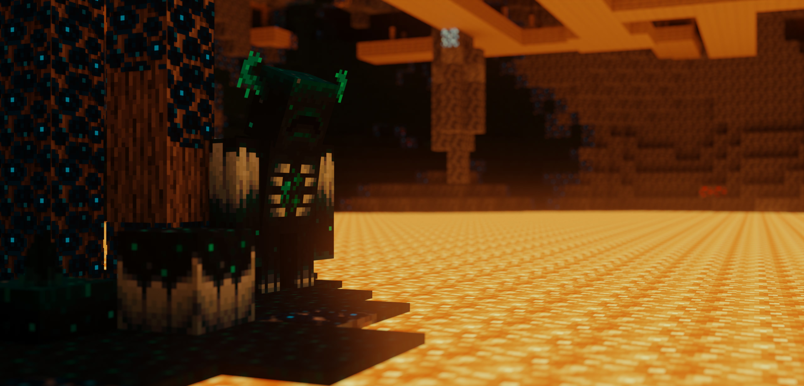

# Mineways, a Minecraft mapper and exporter
**by Eric Haines, erich@acm.org**

**begun 11/14/2011**

Mineways is an open-source GUI program that exports Minecraft maps into 3D models for use in 3D software, printing and rendering. Mineways supports most Minecraft: Java Edition versions and offers many settings and functionality to customize the map export to your needs.

**Homepage is http://mineways.com which redirects to https://www.realtimerendering.com/erich/minecraft/public/mineways/**

The page you're on now holds the open-source code for Mineways. You probably want to go to the homepage above.

# Download

[Visit the project homepage](https://www.realtimerendering.com/erich/minecraft/public/mineways/) for the latest executables for Windows (and usually somewhat older, for MacOS).

Documentation links, credits, etc are also available on the homepage.
Much of the mapping and UI code is built on the open-source project [Minutor](http://seancode.com/minutor/).

Mineways does not have a Linux build (and the MacOS build is often a few versions behind), but it runs well under [WINE](http://www.winehq.org/). See more [here for Linux](https://www.realtimerendering.com/erich/minecraft/public/mineways/downloads.html#linuxPlatformHelp) and [here for MacOS](https://www.realtimerendering.com/erich/minecraft/public/mineways/downloads.html#mac).

You usually want the latest version. If you have problems with it, you might try downloading [an older version](https://www.realtimerendering.com/erich/minecraft/public/mineways/mineways.html#versions). All releases of the code (without EXEs) back to v3.01 are [on Github](https://github.com/erich666/Mineways/releases).

# Compiling

Source files are here:

* **Win/** contains the Windows version of Mineways (in C++).
* **channelMixer/** contains the ChannelMixer for Mineways, which extracts the individual block textures from a mod resource pack into a directory.
* **tileMaker/** contains the TileMaker, which takes the block in that directory and forms a terrainExt.png file for use by Mineways. Using this allows you to replace any terrain textures with your own custom tiles.

## Windows
[Mineways](https://www.realtimerendering.com/erich/minecraft/public/mineways/) comes with executables, but if you prefer, you can compile Mineways with Visual Studio Community 2022:
- Install the "Desktop development with C++" workload
- Go to "Individual components", search on "MFC", and choose "C++ MFC for latest v143 build tools (x86 & x64)".
- Open Mineways.sln in Visual C++, switch the target to "Release" and "x64", then Build | Rebuild Solution.

You should then find a mineways.exe in GitHub\Mineways\x64\Release\Mineways.exe

For more on Visual Studio 2022 and C++, see [Microsoft's tutorials](https://learn.microsoft.com/en-us/cpp/get-started/?view=msvc-170).

Sorry, other platforms are not directly supported, though Mineways runs fine under [WINE](http://www.winehq.org/) and we also provide a Mac-specific version.

If you want to work on the mapping part of this program on another platform, see [Minutor](http://seancode.com/minutor/), which *is* supported on Mac and Linux.

# License

Mineways uses the same [license](license.txt) as Minutor.

#

_Mineways and [JG-RTX](https://github.com/jasonjgardner/jg-rtx) used to make a [test scene asset](https://github.com/usd-wg/assets) for the USD file format. Rendered with [Omniverse USD Composer](https://www.nvidia.com/en-us/omniverse/apps/create/)._
